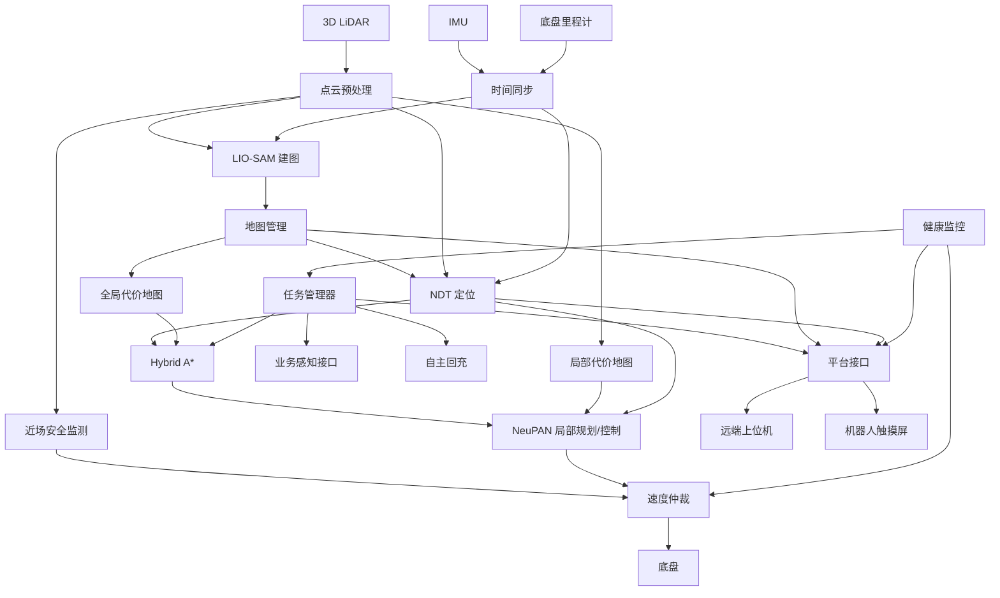

# SLAM 上位机开发功能范围与实施清单

> 项目：二代室内外自主移动巡检机器人  
> 文档定位：SLAM / 导航 / 上位机开发基线  
> 适用对象：负责 SLAM、导航、规划控制、任务调度及上位机/界面集成的开发人员  
> 说明：本文基于《技术方法与路线》《技术标准和规范》《技术开发（委托）合同》进行职责拆分，并按“可直接指导开发”的方式重新组织。  
> 本文**不把业务感知算法本身纳入主责范围**，但会保留与感知模块的接口、任务调度、结果展示和导航联动要求。

---

## 1. 你的职责边界

### 1.1 建议定义的主责范围

你负责的内容应当理解为一套完整的“机器人自主移动 + 上位机管理”系统，而不是单独的 SLAM 算法。

核心链路为：

```text
导航传感器接入
    ↓
时间同步 / TF / 标定 / 点云预处理
    ↓
LIO-SAM 三维建图
    ↓
地图管理
    ↓
NDT 地图定位
    ↓
全局/局部代价地图
    ↓
Hybrid A* 全局规划
    ↓
NeuPAN 局部规划与运动控制
    ↓
安全监测 / 限速 / 停车 / 急停联动
    ↓
底盘执行
    ↓
任务状态机 / 回充 / 故障诊断
    ↓
本机 HMI + 远端上位机
```

因此，建议将你的开发范围拆成以下 12 个一级模块：

1. ROS2 基础框架与设备接口
2. 导航数据预处理、时间同步与 TF
3. 三维建图
4. 地图管理
5. 自主定位
6. 路径规划与运动控制
7. 导航安全与异常恢复
8. 任务执行与自主回充
9. 状态监控与故障诊断
10. 感知模块接口与业务联动
11. 本机 HMI / 远端上位机前端
12. 日志、版本、部署、测试与交付

---

## 2. 明确不属于你的主要开发范围

以下内容原则上由“业务感知模块”负责人承担：

- 火焰/烟雾识别模型；
- 积水、漏水、滴水识别；
- 未佩戴安全帽识别；
- 消防设施状态识别；
- 人脸识别、陌生人员识别；
- 货位/货物异常识别；
- 人群聚集、奔跑、无主物品识别；
- YOLO、语义分割、ByteTrack 等模型训练、数据集制作、模型微调；
- 业务识别模型精度优化；
- 可见光/红外业务图像算法。

但是你仍需要负责这些模块与导航/上位机之间的：

- ROS2 或其他通信接口；
- 任务触发；
- 时间戳、位置和任务 ID 对齐；
- 识别结果接收；
- 告警状态接收；
- 地图位置关联；
- 前端展示；
- 对导航行为有影响的联动；
- 模块掉线或超时时的异常处理。

### 2.1 特别注意：以下“感知”仍属于导航侧

不要把所有点云处理都划给业务感知。

以下能力属于 SLAM / 导航安全链路，应由你负责或至少主导集成：

- 激光雷达数据接入；
- 激光点云范围裁剪；
- 本体点云剔除；
- 异常点过滤；
- 点云降采样；
- 运动畸变补偿；
- 坐标变换；
- 用于局部避障的障碍点云；
- 低位障碍保留；
- 动态障碍几何占用；
- 近场安全区碰撞风险判断。

---

# 3. 总体软件架构

建议 ROS2 软件按以下模块拆分。



---

# 4. ROS2 基础框架与设备接入

## NAV-BASE-01 ROS2 节点架构

需要完成：

- ROS2 Workspace 和 package 划分；
- launch 管理；
- 参数文件组织；
- Topic / Service / Action 定义；
- TF 树定义；
- namespace 规范；
- QoS 规划；
- 生命周期管理；
- 节点异常退出检测。

建议至少拆成：

```text
robot_bringup
sensor_bridge
pointcloud_preprocessor
slam_mapping
localization
map_manager
global_costmap
local_costmap
global_planner
local_controller
safety_monitor
velocity_mux
task_manager
charging_manager
health_monitor
platform_bridge
robot_hmi_bridge
logging_manager
```

---

## NAV-BASE-02 导航传感器接入

导航主数据源：

- 三维激光雷达；
- IMU；
- 底盘轮速/里程计。

还需要读取：

- 底盘状态；
- 电机状态；
- BMS；
- 急停状态；
- 控制器状态；
- 网络状态。

需要至少输出：

- 数据有效状态；
- 最近更新时间；
- 频率；
- 延迟；
- 是否超时；
- 设备健康状态。

---

# 5. 时间同步、坐标与标定

## NAV-TF-01 时间同步

至少保证：

- LiDAR；
- IMU；
- Odometry；

三者时间基准一致。

建议增加：

- 时间偏差检测；
- 时间跳变检测；
- ROS 时间/系统时间监控；
- 传感器延迟统计。

---

## NAV-TF-02 TF 坐标树

建议统一：

```text
map
 └── odom
      └── base_link
           ├── lidar_link
           ├── imu_link
           ├── camera_link
           └── ...
```

需要保证：

- TF 不出现断链；
- 不出现循环；
- 静态 TF 可配置；
- 外参可以版本化；
- TF 时间戳与传感器时间一致。

---

## NAV-TF-03 标定管理

至少维护：

- LiDAR ↔ base_link；
- IMU ↔ base_link；
- 里程计参数；
- 机器人 Footprint；
- 轮距；
- 轮径/速度转换参数。

建议：

```text
config/
  calibration/
    lidar.yaml
    imu.yaml
    chassis.yaml
    footprint.yaml
```

每套标定配置应有版本号。

---

# 6. 点云预处理

## NAV-PC-01 点云处理流水线

应包含：

- 范围裁剪；
- 本体点剔除；
- NaN/异常点过滤；
- 离群点过滤；
- 降采样；
- 运动补偿；
- 坐标变换。

输出建议分为：

```text
/pointcloud/raw
/pointcloud/slam
/pointcloud/localization
/pointcloud/obstacle
```

不同算法可使用不同的点云处理参数。

---

## NAV-PC-02 低位障碍保护

必须重点验证：

- 叉车叉臂；
- 托盘边缘；
- 行李手推车底部横杆；
- 低矮台阶；
- 机器人侧边低位障碍。

不能因为 voxel filter 或高度裁剪把这些障碍滤掉。

---

# 7. 三维建图

## SLAM-MAP-01 LIO-SAM 建图

指定技术路线：

**LIO-SAM + LiDAR + IMU**

需要实现：

- 激光惯性里程计；
- 轨迹估计；
- 因子图优化；
- 回环检测/回环约束；
- 地图更新；
- 地图保存。

---

## SLAM-MAP-02 地图输出

至少输出：

### 三维地图

用于：

- NDT 定位；
- 地图展示；
- 调试分析。

### 二维占据地图

用于：

- 全局规划；
- 区域配置；
- 上位机展示。

---

## SLAM-MAP-03 建图质量检查

建图结束需要检查：

- 轨迹是否连续；
- 是否存在重影；
- 是否存在地图错层；
- 闭环区域是否一致；
- 狭窄通道是否完整；
- 室内外过渡区域是否完整；
- 关键路线是否缺失；
- 地图尺度是否正确。

建议实现一个地图发布前检查流程：

```text
Building
    ↓
Review
    ↓
Validated
    ↓
Published
```

未经验证的地图不能直接用于生产导航。

---

# 8. 地图管理系统

地图管理是目前认知中最容易漏掉的一块。

## MAP-MGR-01 地图 CRUD

需要支持：

- 新建地图；
- 保存地图；
- 加载地图；
- 删除地图；
- 地图重命名；
- 地图导入；
- 地图导出；
- 设置当前地图。

---

## MAP-MGR-02 地图版本管理

地图应具有：

```text
map_id
map_name
version
create_time
update_time
building
floor
checksum
status
```

建议每次正式修改地图后产生新版本。

---

## MAP-MGR-03 多楼宇/多楼层

项目涉及园区和楼宇，因此建议预留：

```text
园区
 ├── 建筑 A
 │    ├── 1F
 │    ├── 2F
 │    └── 3F
 └── 建筑 B
```

不同地图之间可通过：

- 电梯；
- 人工转运；
- 固定锚点；
- 地图切换任务；

进行逻辑关联。

---

## MAP-MGR-04 地图区域编辑

上位机应支持配置：

- 禁行区；
- 虚拟墙；
- 限速区；
- 临时封闭区；
- 充电区；
- 巡检区域；
- 巡检点；
- 等待点；
- 避雨点；
- 特殊安全区域。

每个区域建议带：

```text
id
type
geometry
enabled
speed_limit
priority
valid_time
remark
```

---

# 9. 自主定位

## LOC-01 NDT 地图定位

指定技术路线：

**NDT 点云地图匹配 + IMU + 里程计**

输入：

```text
3D Map
LiDAR
IMU
Odometry
Initial Pose
```

输出：

```text
map -> base_link
Pose
Velocity
Localization Quality
```

---

## LOC-02 初始定位

需要支持：

- 上位机手动指定初始位姿；
- 使用上一次停车位置初始化；
- 自动搜索重定位；
- 指定候选区域重定位。

---

## LOC-03 定位质量状态

建议定义：

```text
UNKNOWN
INITIALIZING
NORMAL
DEGRADED
LOST
RELOCALIZING
```

### NORMAL

允许正常导航。

### DEGRADED

建议：

- 自动限速；
- 加大避障距离；
- 上报状态；
- 记录日志。

### LOST

必须：

- 停止自主移动；
- 禁止继续下发正常速度；
- 启动重定位；
- 上报故障。

---

## LOC-04 定位性能要求

需要以验收指标为目标：

| 指标 | 要求 |
|---|---:|
| 静态定位精度 | ≤ ±10 cm |
| 动态定位精度 | ≤ ±12 cm |
| 重复定位精度 | ≤ ±10 cm |
| 定位响应时间 | ≤ 0.3 s |

建议在软件中长期记录：

```text
fitness_score
matching_score
pose_jump
covariance
lidar_points
ndt_iterations
localization_latency
```

便于现场定位问题。

---

# 10. 环境代价地图

## PLAN-COST-01 全局代价地图

输入：

- 二维 occupancy map；
- 禁行区；
- 虚拟墙；
- 临时封闭区；
- 限速区。

支持：

- obstacle layer；
- inflation layer；
- rule layer；
- static layer。

---

## PLAN-COST-02 局部代价地图

基于实时 3D 点云滚动更新。

要求：

- 保留低位障碍；
- 处理动态障碍；
- 根据 Footprint 膨胀；
- 考虑定位误差；
- 考虑制动距离。

---

# 11. 全局路径规划

## PLAN-GLOBAL-01 Hybrid A*

指定：

**Hybrid A\***

考虑：

- 起点；
- 终点；
- 地图障碍；
- Footprint；
- 差速运动约束；
- 安全距离；
- 目标朝向；
- 路径平滑性。

---

## PLAN-GLOBAL-02 重规划机制

以下情况应触发：

- 新任务；
- 目标变化；
- 路径偏离；
- 障碍持续阻塞；
- 地图规则改变；
- 定位恢复；
- 当前路径失效。

---

## PLAN-GLOBAL-03 路径验证

规划完成后必须进行：

- 完整 Footprint 碰撞检查；
- 路径可行性检查；
- 起终点合法性检查；
- 曲率/转向可执行性检查。

规划失败必须输出具体原因，例如：

```text
START_INVALID
GOAL_INVALID
NO_PATH
COLLISION
TIMEOUT
MAP_INVALID
LOCALIZATION_INVALID
```

---

# 12. 局部规划与运动控制

## CTRL-01 NeuPAN

指定技术路线：

**NeuPAN**

输入：

```text
Global Reference Path
Obstacle Point Cloud
Robot State
Velocity
Footprint
Control Constraints
```

输出：

```text
linear_velocity
angular_velocity
```

---

## CTRL-02 动态行为

机器人应能够：

- 跟踪全局路径；
- 减速；
- 绕障；
- 停车；
- 障碍消失后恢复；
- 请求全局重规划。

---

## CTRL-03 运动约束

需要统一配置：

```text
max_linear_velocity
max_angular_velocity
max_linear_acceleration
max_angular_acceleration
min_turn_radius
stop_distance
safety_distance
```

项目运动参数至少包含：

```text
默认速度：0.5 m/s
最大速度：1.2 m/s
```

---

# 13. 底盘控制接口

## CHASSIS-01 速度控制

需要实现：

```text
cmd_vel -> 底盘控制接口
```

并读取：

```text
wheel_speed
odometry
motor_state
controller_state
emergency_stop
```

---

## CHASSIS-02 指令安全

需要具备：

- cmd_vel 超时；
- 非法值过滤；
- NaN 检查；
- 最大速度限制；
- 最大角速度限制；
- 急停优先；
- 安全监测优先；
- 定位丢失禁止运动。

建议增加独立的：

```text
velocity_mux
```

统一仲裁：

```text
Emergency Stop
Safety Monitor
Manual Control
Navigation Control
```

优先级从高到低控制最终底盘速度。

---

# 14. 安全避障

这一块应当作为独立模块，而不是完全依赖局部规划器。

## SAFE-01 三级安全机制

系统应形成：

```text
第一级：规划避障
第二级：独立近场安全监测
第三级：底盘 / 硬件急停
```

---

## SAFE-02 近场安全区域

建议至少配置三级区域：

```text
Warning Zone
Slow Zone
Stop Zone
```

根据当前速度动态改变安全距离。

---

## SAFE-03 安全优先级

以下状态应高于普通任务：

- 急停；
- 即将碰撞；
- 定位 LOST；
- 核心传感器失效；
- 底盘异常；
- 控制通信异常。

业务感知异常不能影响基础避障能力。

---

# 15. 任务执行系统

任务管理是 SLAM 与业务模块之间的核心 glue layer。

## TASK-01 任务模型

建议定义：

```json
{
  "task_id": "",
  "task_type": "",
  "priority": 0,
  "waypoints": [],
  "actions": [],
  "retry_policy": {},
  "status": ""
}
```

---

## TASK-02 基本任务流程

巡检任务：

```text
接收任务
  ↓
检查机器人状态
  ↓
导航至巡检点
  ↓
确认定位正常
  ↓
确认已停车
  ↓
触发感知/拍照/播报
  ↓
等待业务结果
  ↓
记录结果
  ↓
前往下一点
```

---

## TASK-03 任务控制

必须支持：

- START；
- PAUSE；
- RESUME；
- CANCEL；
- RETRY；
- SKIP；
- FAIL；
- FINISH。

---

## TASK-04 任务状态

建议：

```text
CREATED
QUEUED
RUNNING
PAUSED
WAITING_ACTION
RETRYING
SUCCEEDED
FAILED
CANCELLED
```

所有状态变化绑定：

```text
task_id
timestamp
robot_pose
reason
```

---

# 16. 自主回充

## CHARGE-01 低电回充

BMS 电量达到阈值：

```text
Normal
Low Battery Warning
Force Charging
```

低电时自动生成回充任务。

---

## CHARGE-02 回充流程

```text
低电触发
 ↓
暂停/结束当前任务
 ↓
导航到充电区
 ↓
进入 Docking 模式
 ↓
精确对接
 ↓
确认充电
 ↓
禁止普通移动
```

---

## CHARGE-03 对接异常

需要：

- 超时；
- 对接失败；
- 有限次数重试；
- 最终失败告警；
- 充电状态和 BMS 状态校验。

---

# 17. 状态监控与故障诊断

## HEALTH-01 健康监控

建议统一监控：

```text
LiDAR
IMU
Odometry
Chassis
Motor
BMS
Localization
Planner
Controller
Camera
Perception
Network
Platform
Disk
CPU
GPU
Memory
Temperature
```

---

## HEALTH-02 心跳机制

每个核心模块需要：

```text
heartbeat
last_timestamp
state
error_code
```

至少检测：

- 心跳超时；
- 数据超时；
- 数据频率异常；
- 节点异常退出；
- 驱动掉线。

---

## HEALTH-03 故障等级

建议：

```text
INFO
WARNING
ERROR
FATAL
```

以及：

```text
fault_code
fault_source
fault_description
timestamp
recommended_action
```

---

## HEALTH-04 故障自动处置

例如：

| 故障 | 动作 |
|---|---|
| LiDAR 掉线 | 停车 |
| IMU 持续异常 | 停车 |
| 定位降级 | 限速 |
| 定位丢失 | 停车 + 重定位 |
| 局部规划失败 | 停车 + 全局重规划 |
| 网络断开 | 本地继续/缓存 |
| 平台断开 | 不影响本地导航 |
| BMS 低电 | 回充 |
| 急停 | 立即输出零速度 |

---

# 18. 与业务感知模块的接口

你不负责感知模型，但一定要先把接口定义好，否则后期集成会非常痛苦。

## PER-IF-01 任务触发接口

导航到点后：

```text
trigger_perception(
    task_id,
    waypoint_id,
    perception_type,
    robot_pose,
    timestamp
)
```

---

## PER-IF-02 感知结果

建议统一格式：

```json
{
  "task_id": "",
  "waypoint_id": "",
  "event_id": "",
  "event_type": "",
  "confidence": 0.0,
  "status": "CONFIRMED",
  "timestamp": 0,
  "pose": {},
  "evidence": [],
  "extra": {}
}
```

---

## PER-IF-03 感知状态

你至少需要知道：

```text
READY
BUSY
DEGRADED
OFFLINE
ERROR
```

---

## PER-IF-04 感知异常处理

感知模块挂掉时：

- 不能影响基本导航；
- 不能影响急停；
- 不能影响避障；
- 任务系统应记录动作失败；
- 根据任务策略选择重试/跳过/终止；
- 上位机显示异常。

---

## PER-IF-05 感知到导航的联动

部分感知结果可能影响导航：

### 通道堵塞

感知输出：

```text
BLOCKED_AREA
```

导航侧可以：

- 新增临时障碍；
- 设置临时禁行区；
- 重规划。

### 积水风险区

可转换：

```text
Temporary Keepout Zone
```

### 户外降雨

任务系统可：

- 暂停非紧急任务；
- 导航至避雨点。

联动策略最终仍由任务/导航侧执行。

---

# 19. 外部接口体系

## API-01 ROS2 内部接口

必须明确：

- Topic；
- Service；
- Action；
- TF；
- message type；
- QoS。

建议建立单独：

```text
robot_interfaces
```

package。

---

## API-02 平台接口

合同要求至少覆盖：

- 任务下发；
- 任务状态回传；
- 任务失败重试；
- 传感器心跳；
- 故障上报；
- 日志查询。

建议统一 JSON 数据结构。

---

## API-03 建议的外部接口分类

```text
/api/robot/status
/api/robot/health

/api/map/list
/api/map/load
/api/map/save
/api/map/area

/api/navigation/goal
/api/navigation/cancel
/api/navigation/status

/api/task/create
/api/task/pause
/api/task/resume
/api/task/cancel

/api/event/report

/api/log/query
/api/log/download

/api/config/get
/api/config/update
```

---

# 20. 网络与离线运行

机器人核心功能不能依赖服务器实时在线。

## NET-01 断网运行

断网后：

- SLAM 正常；
- 定位正常；
- 规划正常；
- 避障正常；
- 急停正常；
- 底盘控制正常；
- 当前任务根据策略继续执行。

---

## NET-02 数据缓存

需要缓存：

- 任务状态；
- 故障；
- 告警；
- 感知事件；
- 关键日志。

恢复网络后：

```text
Local Cache
   ↓
Retry Queue
   ↓
Platform
```

需防止重复上传。

建议每条消息带：

```text
message_id
timestamp
retry_count
```

---

# 21. 日志、录包与问题复现

文档明确要求关键日志可保存、查询、导出和用于问题复现。

## LOG-01 结构化运行日志

建议包含：

```text
timestamp
module
level
task_id
robot_pose
state
event
error_code
message
```

---

## LOG-02 导航关键日志

至少记录：

- 建图状态；
- 定位状态；
- NDT score；
- 全局规划结果；
- 局部规划状态；
- 重规划原因；
- cmd_vel；
- 安全停车原因；
- 任务状态；
- 故障码。

---

## LOG-03 ROS bag 录制

虽然合同主要写的是“日志保存/查询/导出”，但为了 SLAM 和导航问题复现，强烈建议实现：

### 手动录包

```text
Start Record
Stop Record
```

### 自动触发录包

出现以下情况保存故障前后数据：

- 定位 LOST；
- 位姿跳变；
- 规划失败；
- 碰撞风险停车；
- 底盘通信故障；
- 任务异常。

建议采用循环缓冲：

```text
故障前 30s + 故障后 30s
```

---

## LOG-04 回放调试

需要支持：

```text
ros2 bag play
```

复现：

- 定位；
- 规划；
- 避障；
- 控制；
- 故障。

---

# 22. 参数与版本管理

## VER-01 版本对象

建议统一管理：

```text
software_version
map_version
navigation_param_version
calibration_version
task_config_version
interface_version
```

对感知侧至少记录：

```text
perception_model_version
```

但模型内容本身无需你维护。

---

## VER-02 参数配置

导航参数不要散落在代码里。

建议目录：

```text
config/
├── sensor/
├── slam/
├── localization/
├── planning/
├── control/
├── safety/
├── charging/
├── network/
└── task/
```

---

## VER-03 配置发布

配置修改建议有：

```text
Draft
Testing
Released
Rollback
```

并保留：

- 修改人；
- 修改时间；
- 修改内容；
- 旧版本。

---

# 23. 机器人触摸屏 HMI

合同要求触摸屏常驻界面，并兼容一代交互方式。

你至少应提供 SLAM / 导航相关的数据接口，并建议直接负责对应页面。

## HMI-01 主界面

显示：

- 当前机器人状态；
- 当前任务；
- 电量；
- 网络状态；
- 定位状态；
- 故障状态。

---

## HMI-02 地图界面

显示：

- 2D 栅格地图；
- 机器人当前位置；
- 机器人朝向；
- 已走轨迹；
- 当前规划路径；
- 巡检点；
- 充电点；
- 禁行区。

---

## HMI-03 任务界面

显示：

```text
任务名称
当前点位
当前阶段
完成进度
任务结果
```

支持：

- 暂停；
- 恢复；
- 取消。

---

## HMI-04 引导/语音联动

如果语音模块由其他人负责，你只负责界面联动：

- 待机卡通页；
- 语音唤醒后切换功能页；
- 引导讲解文字；
- 当前语音任务状态。

---

## HMI-05 故障页面

需要：

- 故障代码；
- 故障描述；
- 发生时间；
- 当前处理状态；
- 是否允许恢复。

---

# 24. 远端上位机 / 管理平台

这是你当前认知里“前端展示”之外需要显著补充的内容。

## WEB-01 运行总览

建议显示：

- 在线/离线；
- 当前地图；
- 实时位置；
- 当前任务；
- 电量；
- 定位状态；
- 导航状态；
- 故障数；
- 告警数。

---

## WEB-02 实时地图

显示：

- 栅格地图；
- 机器人；
- 实时轨迹；
- 当前路径；
- 巡检点；
- 充电区；
- 禁行区；
- 限速区；
- 临时封闭区。

---

## WEB-03 地图管理

支持：

- 开始建图；
- 停止建图；
- 保存地图；
- 地图列表；
- 地图加载；
- 地图版本；
- 园区/楼宇/楼层管理。

---

## WEB-04 地图编辑

支持：

- 绘制禁行区；
- 绘制限速区；
- 绘制虚拟墙；
- 设置充电点；
- 设置巡检点；
- 设置避雨点；
- 编辑点位方向。

---

## WEB-05 巡检点管理

CRUD：

```text
name
map_id
x
y
yaw
action
perception_type
wait_time
```

---

## WEB-06 任务管理

支持：

### 常规任务

周期巡检。

### 指定任务

人工临时下发。

### 强制单次任务

例如：

- 引导；
- 解说；
- 临时移动。

---

## WEB-07 任务控制

运行过程中：

- Pause；
- Resume；
- Cancel；
- Retry。

并显示：

- 当前 waypoint；
- 执行动作；
- 剩余点位；
- 失败原因。

---

## WEB-08 BMS 页面

至少显示：

- 电量；
- 电压；
- 电流；
- 充电状态；
- 低电告警；
- 回充状态。

如果底层允许，可提供相应控制接口，但必须经过安全策略。

---

## WEB-09 故障诊断

显示：

- 当前故障；
- 历史故障；
- 故障等级；
- 故障代码；
- 故障模块；
- 故障时间。

支持：

- 查询；
- 筛选；
- 导出。

---

## WEB-10 日志页面

支持：

- 按时间查询；
- 按模块查询；
- 按 task_id 查询；
- 按 fault_code 查询；
- 下载日志；
- 下载 rosbag。

---

# 25. 数据持久化

上位机建议至少维护以下数据对象：

```text
Robot
Map
MapVersion
Area
Waypoint
Task
TaskStep
TaskExecution
Event
Fault
LogFile
ConfigVersion
SoftwareVersion
```

如果平台只有一台机器人，也建议从一开始保留 `robot_id`。

---

# 26. 安全权限

远端控制必须低于机器人本地安全策略。

建议至少区分：

```text
Viewer
Operator
Engineer
Admin
```

危险操作：

- 手动移动；
- 参数修改；
- 地图切换；
- 定位初始化；
- 清除故障；

建议增加二次确认。

---

# 27. 启停与恢复

机器人软件不是“启动所有节点就完事”。

建议设计统一状态机：

```text
BOOTING
INITIALIZING
READY
RUNNING
PAUSED
DEGRADED
FAULT
EMERGENCY_STOP
CHARGING
SHUTDOWN
```

---

## 27.1 启动检查

启动时检查：

- LiDAR；
- IMU；
- 里程计；
- TF；
- 地图；
- 定位；
- 底盘；
- 急停；
- BMS。

全部满足才能进入：

```text
READY
```

---

## 27.2 故障恢复

安全故障解除不能直接恢复移动。

应重新检查：

```text
传感器
定位
近场安全区域
底盘
急停
```

然后才允许恢复任务。

---

# 28. 手动调试工具

开发阶段强烈建议做一个 Engineering Mode。

至少支持：

- 查看 ROS topic 状态；
- 查看 TF；
- 查看实时点云；
- 查看 NDT score；
- 手动设 Initial Pose；
- 手动 Nav Goal；
- 清除局部 costmap；
- 触发重定位；
- 查看 planner path；
- 查看 controller 输出；
- 修改部分导航参数；
- 保存日志；
- 开始/停止 rosbag。

这些功能后面现场调参会非常省时间。

---

# 29. 性能监控

建议监控：

```text
CPU
GPU
Memory
Disk
Network
ROS Frequency
Localization Latency
Planner Latency
Controller Frequency
```

需要避免：

- GUI 导致 SLAM 卡顿；
- 日志导致磁盘爆满；
- rosbag 导致 IO 阻塞。

---

# 30. 前端与导航核心隔离

这是一个明确的软件设计要求。

前端崩溃：

```text
不能导致 Navigation 崩溃
```

Web 后端崩溃：

```text
不能导致 robot 停止基础自主导航
```

网络断开：

```text
不能导致 SLAM / Localization / Safety 失效
```

建议采用：

```text
Navigation Core
      ↕
Platform Bridge
      ↕
API Server
      ↕
Frontend
```

而不是让前端直接访问导航进程内部对象。

---

# 31. 建议接口状态码体系

建议统一：

```text
0     SUCCESS

1xxx  TASK
2xxx  SLAM
3xxx  LOCALIZATION
4xxx  PLANNING
5xxx  CONTROL
6xxx  SENSOR
7xxx  CHASSIS
8xxx  NETWORK
9xxx  PERCEPTION
```

例如：

```text
3001 LOCALIZATION_LOST
3002 LOCALIZATION_DEGRADED

4001 GLOBAL_PLAN_FAILED
4002 GOAL_UNREACHABLE

5001 LOCAL_CONTROL_FAILED

6001 LIDAR_TIMEOUT
6002 IMU_TIMEOUT
```

---

# 32. 测试要求

## TEST-01 单元测试

至少覆盖：

- 坐标转换；
- 地图加载；
- 区域判断；
- 任务状态机；
- API；
- 错误码。

---

## TEST-02 SLAM 测试

检查：

- 地图重影；
- 闭环；
- 长走廊；
- 重复货架；
- 室内外切换；
- 大场景漂移。

---

## TEST-03 定位测试

验证：

- 静态定位；
- 动态定位；
- 重复定位；
- 初始定位；
- 定位丢失；
- 重定位；
- 位姿跳变。

---

## TEST-04 规划测试

场景：

- 普通通道；
- 狭窄通道；
- 死路；
- 路径阻塞；
- 动态障碍；
- 临时禁行；
- 目标不可达。

---

## TEST-05 安全测试

必须覆盖：

- 静态障碍；
- 动态障碍；
- 低位障碍；
- 盲角；
- 原地旋转；
- 倒车；
- 斜坡；
- 急停；
- 恢复。

---

## TEST-06 网络测试

验证：

```text
Wi-Fi/5G 正常
↓
断网
↓
任务继续或安全暂停
↓
缓存数据
↓
网络恢复
↓
补传
```

---

## TEST-07 故障注入

建议主动测试：

```text
拔 LiDAR
拔 IMU
断底盘通信
关闭定位节点
关闭规划器
关闭感知模块
断服务器
磁盘接近满
```

验证机器人是否进入正确安全状态。

---

# 33. 验收材料

你负责的模块最终不仅是“代码能跑”。

至少准备：

## 软件

- 完整源代码；
- Git 版本记录；
- 构建脚本；
- launch；
- 配置文件；
- 地图；
- 数据库初始化；
- 前端工程。

## 文档

- 系统架构设计；
- SLAM 设计；
- 定位设计；
- 规划控制设计；
- 接口文档；
- 数据结构文档；
- 部署文档；
- 参数说明；
- 运维手册；
- 用户操作手册。

## 测试

- SLAM 测试报告；
- 定位精度报告；
- 规划避障测试；
- 故障测试；
- 网络异常测试；
- 回充测试；
- 上位机功能测试。

## 第三方组件

需要整理：

```text
name
version
purpose
license
source
```

尤其：

- LIO-SAM；
- NDT 实现；
- Hybrid A* 相关库；
- NeuPAN；
- ROS2 packages；
- 前端依赖。

---

# 34. 推荐开发优先级

## P0：机器人先跑起来

### 基础链路

- ROS2 Bringup；
- LiDAR；
- IMU；
- Odometry；
- TF；
- 点云处理；
- 底盘 cmd_vel。

### SLAM

- LIO-SAM 建图；
- 地图保存。

### 定位

- 地图加载；
- NDT；
- Initial Pose；
- Localization State。

### 导航

- Global Costmap；
- Local Costmap；
- Hybrid A*；
- NeuPAN；
- 基础避障；
- Nav Goal。

---

## P1：达到完整机器人功能

- 地图管理；
- 巡检点；
- Task Manager；
- Pause / Resume / Cancel；
- 自动重规划；
- 故障诊断；
- Safety Monitor；
- 自动回充；
- 感知接口；
- 网络断线缓存。

---

## P2：上位机

- Web Backend；
- 实时地图；
- 机器人状态；
- 地图编辑；
- 巡检点编辑；
- 任务编辑；
- 故障页面；
- 日志页面；
- BMS 页面；
- 参数管理。

---

## P3：工程化和验收

- rosbag 自动触发；
- 回放工具；
- 软件版本管理；
- 地图版本管理；
- 参数版本管理；
- 一键部署；
- watchdog；
- 自动启动；
- 测试工具；
- 性能统计；
- 验收报告。

---

# 35. 建议的里程碑

## M1 — 基础移动

目标：

```text
Sensor → TF → cmd_vel → Chassis
```

完成：

- 驱动；
- TF；
- 底盘接口；
- RViz 调试。

---

## M2 — 建图

目标：

```text
LIO-SAM 能稳定完成场景地图
```

完成：

- 点云预处理；
- LIO-SAM；
- 3D Map；
- 2D Map；
- 地图保存。

---

## M3 — 定位

目标：

```text
加载地图后机器人能够持续稳定定位
```

完成：

- NDT；
- Initial Pose；
- localization quality；
- lost/relocalization。

---

## M4 — 点到点导航

目标：

```text
Goal → Hybrid A* → NeuPAN → Chassis
```

---

## M5 — 安全导航

完成：

- 动态障碍；
- 低位障碍；
- safety monitor；
- 重规划；
- 紧急停车。

---

## M6 — 巡检任务

完成：

- waypoint；
- task；
- perception trigger；
- task result；
- pause/resume/cancel。

---

## M7 — 上位机

完成：

- 地图；
- 轨迹；
- 状态；
- 点位；
- 任务；
- 故障；
- 日志。

---

## M8 — 回充 + 工程化

完成：

- 低电；
- charging task；
- docking；
- offline cache；
- watchdog；
- logging；
- version management。

---

## M9 — 验收

完成：

- 定位指标；
- 导航场景；
- 安全工况；
- 故障注入；
- 断网；
- 长时间稳定性；
- 交付文档。

---

# 36. 开发任务总清单

可以直接作为后续 TODO。

## 基础设施

- [ ] ROS2 workspace
- [ ] Package 架构
- [ ] Launch
- [ ] Parameter system
- [ ] TF tree
- [ ] Sensor health
- [ ] Chassis interface

## SLAM

- [ ] Point cloud preprocessing
- [ ] Motion compensation
- [ ] LIO-SAM
- [ ] Loop closure
- [ ] 3D map save
- [ ] 2D map generation
- [ ] Map quality validation

## Map

- [ ] Map load/save
- [ ] Map list
- [ ] Map version
- [ ] Building/floor
- [ ] Keepout zone
- [ ] Speed zone
- [ ] Virtual wall
- [ ] Charging zone
- [ ] Patrol waypoint

## Localization

- [ ] NDT
- [ ] IMU/Odom fusion
- [ ] Initial pose
- [ ] Localization score
- [ ] DEGRADED
- [ ] LOST
- [ ] Relocalization

## Planning

- [ ] Global costmap
- [ ] Local costmap
- [ ] Footprint
- [ ] Inflation
- [ ] Hybrid A*
- [ ] Path validation
- [ ] Replanning

## Control

- [ ] NeuPAN
- [ ] Velocity limits
- [ ] Acceleration limits
- [ ] Dynamic obstacle handling
- [ ] Stop logic
- [ ] velocity_mux

## Safety

- [ ] Near-field safety monitor
- [ ] Slow zone
- [ ] Stop zone
- [ ] Emergency stop
- [ ] Fault recovery conditions

## Task

- [ ] Task model
- [ ] Task queue
- [ ] Waypoint task
- [ ] Action task
- [ ] Pause
- [ ] Resume
- [ ] Cancel
- [ ] Retry
- [ ] Skip
- [ ] Task log

## Charging

- [ ] Low battery trigger
- [ ] Charging task
- [ ] Navigate to dock
- [ ] Docking
- [ ] Charging lock
- [ ] Charging failure retry

## Perception Integration

- [ ] Trigger API
- [ ] Result API
- [ ] Perception heartbeat
- [ ] Task ID association
- [ ] Pose/time association
- [ ] Perception failure handling
- [ ] Navigation linkage

## Fault

- [ ] Heartbeat
- [ ] Watchdog
- [ ] Fault code
- [ ] Fault level
- [ ] Fault history
- [ ] Safe stop
- [ ] Recovery

## Log

- [ ] Structured logs
- [ ] Navigation logs
- [ ] Task logs
- [ ] Fault logs
- [ ] rosbag
- [ ] Automatic incident recording
- [ ] Log query
- [ ] Log export

## Network

- [ ] Platform reconnect
- [ ] Offline execution
- [ ] Local cache
- [ ] Retry queue
- [ ] Duplicate protection

## HMI

- [ ] Main status
- [ ] Map
- [ ] Robot trajectory
- [ ] Planned path
- [ ] Task state
- [ ] Fault state
- [ ] BMS
- [ ] Guidance text

## Web Upper Computer

- [ ] Robot dashboard
- [ ] Realtime map
- [ ] Mapping control
- [ ] Map management
- [ ] Area editing
- [ ] Waypoint CRUD
- [ ] Task CRUD
- [ ] Task execution
- [ ] Pause/resume
- [ ] BMS console
- [ ] Fault console
- [ ] Log console
- [ ] Version display

## Deployment

- [ ] One-click bringup
- [ ] Auto startup
- [ ] Process watchdog
- [ ] Build documentation
- [ ] Deployment documentation
- [ ] Third-party dependency list
- [ ] License list

## Acceptance

- [ ] Static localization ≤ ±10 cm
- [ ] Dynamic localization ≤ ±12 cm
- [ ] Repeat localization ≤ ±10 cm
- [ ] Localization response ≤ 0.3 s
- [ ] Default speed 0.5 m/s
- [ ] Maximum speed 1.2 m/s
- [ ] Static obstacle test
- [ ] Dynamic obstacle test
- [ ] Low obstacle test
- [ ] Narrow corridor test
- [ ] Blind-corner test
- [ ] Rotation test
- [ ] Reverse test
- [ ] Slope test
- [ ] Network loss test
- [ ] Sensor loss test
- [ ] Localization loss test
- [ ] Charging test
- [ ] Long-running stability test

---

# 37. 最终建议的职责划分

| 模块 | 你的职责 |
|---|---|
| LiDAR / IMU / Odom 导航接入 | 主责 |
| 时间同步 / TF / 导航标定 | 主责 |
| 点云导航预处理 | 主责 |
| LIO-SAM | 主责 |
| NDT | 主责 |
| 地图管理 | 主责 |
| Costmap | 主责 |
| Hybrid A* | 主责 |
| NeuPAN | 主责 |
| 底盘导航控制接口 | 主责 |
| 安全监测 | 主责/联合底盘 |
| 任务状态机 | 主责 |
| 自主回充任务逻辑 | 主责/联合底盘 |
| 故障诊断 | 主责 |
| 日志 | 主责 |
| 上位机 | 主责 |
| 机器人触摸屏 SLAM 页面 | 主责或提供数据接口 |
| 感知模型训练 | 非主责 |
| 烟火/积水/安全帽等算法 | 非主责 |
| 感知任务调度 | 主责 |
| 感知结果接口 | 主责 |
| 感知结果地图关联 | 主责 |
| 感知结果 UI 展示 | 主责/前端 |
| 机械结构 | 非主责 |
| 电机底层固件 | 非主责 |
| 硬件急停电路 | 非主责，但必须完成软件联动 |

---

# 38. 一句话定义你最终要交付的系统

你的目标不应该定义成：

> “做一个 SLAM，再加一个界面。”

而应定义成：

> **完成一套基于 ROS2 的机器人自主移动与上位机系统：以 LIO-SAM 建图、NDT 定位、Hybrid A* 全局规划、NeuPAN 局部规划控制为核心，提供地图管理、导航安全、任务执行、自主回充、状态诊断、日志追溯、感知模块接口，以及机器人本机和远端管理界面，并达到合同约定的导航性能及整机验收要求。**

---

# 39. 现阶段最建议先落实的 8 件事

如果准备马上开始开发，建议先按下面顺序做：

1. **确定 ROS2 package / node 架构。**
2. **确定完整 TF tree 和传感器接口。**
3. **跑通 LiDAR + IMU + Odom。**
4. **完成 LIO-SAM → 3D/2D 地图闭环。**
5. **完成 Map Manager + NDT。**
6. **完成 Costmap + Hybrid A* + NeuPAN。**
7. **定义 Task / Perception / Fault 三类统一接口。**
8. **最后再基于稳定后端做上位机 UI。**

尤其不要过早把大量时间放在页面视觉效果上。上位机的核心首先应是：

```text
地图管理
+
任务控制
+
机器人状态
+
故障诊断
+
导航可视化
+
日志调试
```

这些后端数据模型和接口稳定后，前端实现会快很多。
